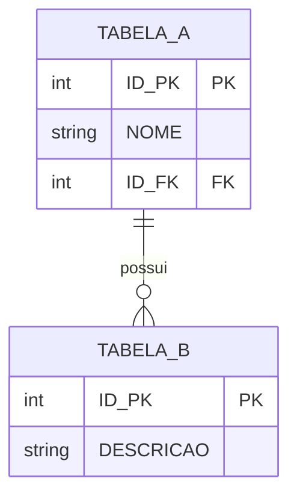
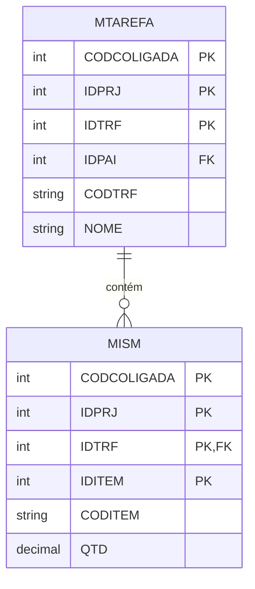

# Skill: Diagrama de Relacionamento de Tabelas (Mermaid ER Diagram)

## Quando usar

Use esta skill quando o usuário solicitar um **diagrama**, **esquema**, **relacionamento** ou **estrutura** de tabelas do banco de dados, como por exemplo:
- "Gere o diagrama de relacionamento das tabelas ..."
- "Mostre a estrutura das tabelas ..."
- "Faça um diagrama entidade-relacionamento ..."
- "Como as tabelas X, Y, Z se relacionam?"
- **Sempre que você gerar uma consulta SQL que contém JOIN entre tabelas** — você DEVE automaticamente incluir o diagrama ER das tabelas envolvidas, mesmo que o usuário não tenha pedido explicitamente.

## Formato de saída OBRIGATÓRIO

Você **DEVE** gerar a resposta usando a sintaxe **Mermaid ER Diagram** dentro de um bloco de código com a linguagem **mermaid**:



## Regras importantes

1. **Sempre use `erDiagram`** como primeira linha do diagrama
2. **Sempre use o bloco ````mermaid`** (nunca um bloco de código genérico)
3. **Inclua legendas** nos relacionamentos usando aspas duplas: `: "legenda"`
4. **Cardinalidade**: use a notação Mermaid padrão:
   - `||--||` : um para um
   - `||--o{` : um para muitos (opcional)
   - `||--|{` : um para muitos (obrigatório)
   - `}o--||` : muitos para um (opcional)
   - `}o--o{` : muitos para muitos
5. **Colunas**: inclua tipo e constraint (PK, FK) dentro da definição da tabela
6. **Use erDiagram** para diagramas entidade-relacionamento de tabelas SQL
7. **Se houver muitas tabelas**, foque nas principais e nos relacionamentos mais relevantes
8. **Sempre preceda** o diagrama com uma breve explicação textual do relacionamento entre as tabelas

## Exemplo completo

````
A tabela `MTAREFA` contém as tarefas dos projetos, enquanto `MISM` armazena as insumos/materiais associados a cada tarefa. O relacionamento é feito através do IDTRF.


````

